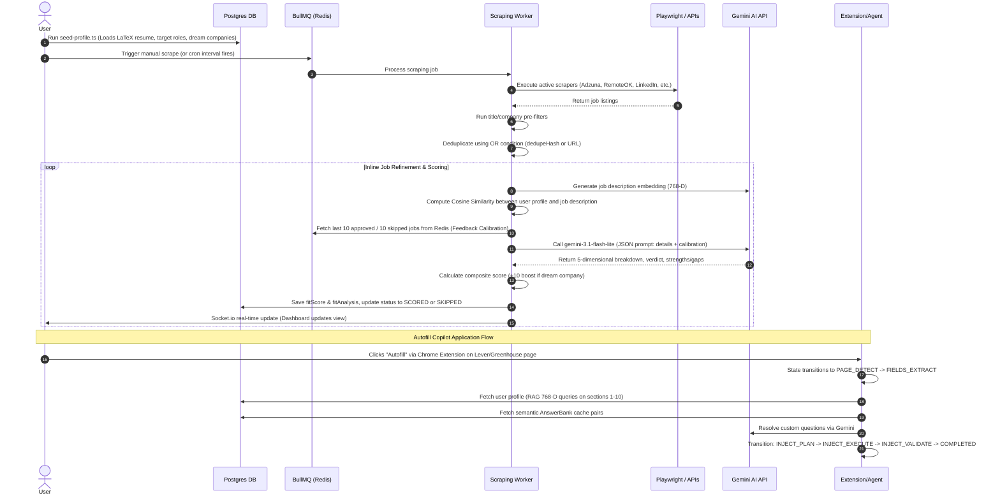

# 🚀 Automated Job Hunting Platform (JobHunt) — Architecture & Workflow

This document provides a detailed overview of the system architecture, technology stack, directory structure, and complete data workflow of the **JobHunt** application.

---

## 🏗️ System Architecture

The platform uses a **Human-in-the-Loop (Review Mode)** architecture split into two key operational modes:
1. **API & Real-time Layer**: Exposes REST endpoints and WebSockets to power the user dashboard.
2. **Asynchronous Worker Layer**: Powered by BullMQ and Redis, this layer handles CPU-bound browser automation (scraping), inline Gemini AI scoring/refinement, and stores high-dimensional embeddings for jobs.
3. **Stateful Chrome Extension Copilot**: Operates a 19-state sense-plan-act loop on the backend (with Redis state persistence) that extracts Greenhouse/Lever forms, performs RAG searches, maps fields, and auto-injects answers into the DOM.

```
┌─────────────────────────────────────────────────────────┐
│                    FRONTEND DASHBOARD                   │
│              (Next.js 16 + Tailwind CSS v4)             │
│  - Job Feed    - Resume Studio    - Real-time Stats     │
└───────────────┬────────────────────────▲────────────────┘
                │ REST (Axios)           │ WebSockets (Socket.io)
┌───────────────▼────────────────────────┴────────────────┐
│                   BACKEND API (Express)                 │
│  - Settings API  - Jobs API  - Application API          │
└───────────────┬────────────────────────┬────────────────┘
                │ Enqueues Jobs          │ Queries / Persists
┌───────────────▼────────────────┐ ┌──────▼────────────────┐
│      REDIS (BullMQ Queues)     │ │   DATABASE (Postgres) │
│  - job-scraping  - job-scoring │ │   - Prisma Client ORM │
└───────────────┬────────────────┘ │   - pgvector (768-D)  │
                │ Worker Processes └──────▲────────────────┘
┌───────────────▼─────────────────────────┴────────────────┐
│                 BULLMQ BACKGROUND WORKER                 │
│  - Playwright Headless Browser (LinkedIn Detail Scraping)│
│  - Gemini AI Engine (Inline Scoring & 768-D Embeddings)  │
└───────────────────────┬──────────────────────────────────┘
                        │
                        ▼ (Real-time Copilot Link)
┌──────────────────────────────────────────────────────────┐
│                CHROME COPILOT EXTENSION                  │
│  - 19-State Sense-Plan-Act Loop (State saved in Redis)   │
│  - RAG Semantic Querying & AnswerBank Cache Lookup       │
└──────────────────────────────────────────────────────────┘
```

---

## 🧱 Tech Stack

### Frontend Dashboard
* **Framework**: **Next.js 16 (React 19)** using the App Router.
* **Styling**: **Tailwind CSS v4** + modern transitions with **Framer Motion**.
* **Code Editor**: **`@monaco-editor/react`** (powers the LaTeX resume editor inside the browser).
* **Communication**: **Axios** (REST requests) and **`socket.io-client`** (real-time WebSocket updates like job score updates).
* **Analytics**: **Recharts** (used to display dashboard graphs).

### Backend Server & Worker
* **Runtime/Language**: **Node.js** + **TypeScript** (run in dev mode with `tsx watch` for hot-reloading).
* **Framework**: **Express.js** (for REST APIs).
* **Database**: **PostgreSQL** accessed via **Prisma Client ORM**.
* **Task Queue**: **BullMQ** + **Redis** (handles background workers for scraping and scoring, allowing stuck-job recovery on start-up).
* **Real-time Server**: **Socket.io** (pushes real-time events to the frontend).
* **Browser Automation**: **Playwright** (launches headless Chromium to bypass anti-scraping blocks on LinkedIn and extract job descriptions).
* **AI Engine**: **`@google/generative-ai`** SDK:
  * **`gemini-3.1-flash-lite`** (JSON Mode): Used for multi-dimensional grading and text generation (reasons, strengths, gaps).
  * **`gemini-embedding-001`**: Generates 768-dimensional vector representations for resume semantic searches and RAG retrieval.

---

## 🗂️ Key Folders & Modules

* **[`backend/src/api/`](file:///c:/Users/Lenovo/Code/JobHunt/backend/src/api/)**: REST API route controllers.
  * `jobs.ts`: Listing, stats, manually trigger scraping, and PATCH status updates (Approve/Skip/Blacklist).
* **[`backend/src/core/`](file:///c:/Users/Lenovo/Code/JobHunt/backend/src/core/)**: Shared wrappers for database, queues, and APIs.
  * `gemini.ts`: Enforces a 15 RPM token-bucket rate limiter, retries with exponential backoff, and parses Gemini's JSON output.
  * `scraperHealth.ts`: A Redis-backed **Circuit Breaker** for scrapers. Automatically transitions to `OPEN` (skips scraper) on 3 consecutive failures, and `HALF-OPEN` (re-tests) after a 2-hour cooldown.
* **[`backend/src/jobs/`](file:///c:/Users/Lenovo/Code/JobHunt/backend/src/jobs/)**: Job queues.
  * `queues.ts`: Declares BullMQ queues and worker logic.
* **[`backend/src/services/scrapers/`](file:///c:/Users/Lenovo/Code/JobHunt/backend/src/services/scrapers/)**: Individual scrapers.
  * `adzuna.ts`, `remoteok.ts`, `wellfound.ts`, `instahyre.ts`, `linkedin.ts`: Platform-specific scrapers extending the base class.
  * `index.ts`: The orchestrator. Coordinates scraping, applies keyword filtering, deduplicates listings, refines/scores listings inline, and persists scored records.
* **[`backend/src/services/ai-engine/`](file:///c:/Users/Lenovo/Code/JobHunt/backend/src/services/ai-engine/)**: The intelligence core.
  * `scorer.ts`: Evaluates job JDs across 5 dimensions using Chain of Thought (CoT). Auto-detects target/dream companies for a `+10` score boost.
  * `feedback.ts`: Stores your last 10 approved and 10 skipped jobs in Redis capped lists. Injects this context into subsequent scoring prompts to align AI judgment with your preferences.
  * `autofillAgent.ts`: Orchestrates the 19-state sense-plan-act loop for Greenhouse/Lever forms, saving run state in Redis.
  * `ragService.ts`: Embeds and queries custom knowledge chunks from `ProfileData.md` across 10 sections.
* **[`backend/src/scripts/`](file:///c:/Users/Lenovo/Code/JobHunt/backend/src/scripts/)**: Maintenance scripts.
  * `seed-profile.ts`: Seeds target settings and parses your raw LaTeX resume.
  * `requeue-failed-jobs.ts`: Finds failed or stale runs and enqueues them back into the worker.

---

## 🔄 Complete Workflow


